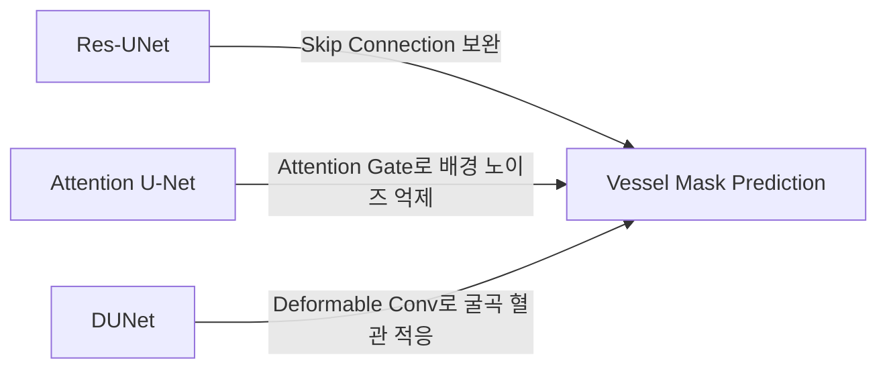

# 관상동맥 3D 복원 PoC: 초기 탐색 단계 (Exploratory Phase) 연구 보고서

본 보고서는 관상동맥 조영술(Coronary Angiography, CAG) 비디오로부터 3차원 혈관 주행 경로(3D Trajectory)를 복원하기 위해 프로젝트 초기에 수행된 **초기 탐색 단계(Exploratory Phase)**의 설계, 실험 과정 및 정량적/정성적 결과를 상세히 기록합니다.

---

## 1. 초기 탐색 단계 개요 및 설계

### 1.1 연구 배경 및 문제 단순화
심장의 끊임없는 박동과 2차원 조영 투영 영상(X-ray Projection)의 중첩(Vessel Overlapping) 문제로 인해 직접적인 3차원 복원은 매우 어렵습니다. 초기 탐색 단계에서는 복잡한 문제를 다음과 같이 단순화하여 접근했습니다:
1. **Cardiac Gating (ECG-free)**: 조영제 노출이 가장 극대화되고 심장 움직임이 상대적으로 정적인 **이완기말(End-Diastole, ED) 프레임**만을 비디오 클립에서 자동으로 추출하여 정적(Static) 프레임 복원 문제로 변환.
2. **2D 이진 세그멘테이션 (2D Binary Segmentation)**: 혈관의 내벽과 외벽 경계를 엄밀히 따기 전 단계로, 조영제가 채워진 혈관 전체 영역을 배경과 분리하는 이진 분류 학습 진행.
3. **이진 삼각측량 (Binary Triangulation)**: 2D 이진 마스크의 1픽셀 뼈대(Skeleton)를 추출한 뒤, C-Arm 촬영 기하 구도를 역산한 투영 행렬 $P$를 통해 두 뷰 간의 중심선 매칭 및 Triangulation 수행.

### 1.2 평가 대상 단일태스크 이진 모델 (Single-Task Binary Models)
학습 데이터가 희소한 환경에서 혈관 분할 성능을 극대화하기 위해 세 가지 SOTA 계열 U-Net 구조를 구현하여 대조 실험을 진행했습니다:



1. **Res-UNet**: 엔코더-디코더 블록에 잔차 연결(Residual Connection)을 추가하여 깊은 레이어에서의 그래디언트 소실을 방지하고 혈관의 저수준 특징(Low-level features)을 효과적으로 보존.
2. **Attention U-Net**: 디코더 상향 신호와 엔코더 스킵 연결 신호 간의 게이팅 메커니즘(Attention Gate)을 적용하여 배경 노이즈를 억제하고 혈관 부위에 픽셀 가중치 집중.
3. **Deformable U-Net (DUNet)**: 표준 컨볼루션 커널 대신 **Deformable Convolution (DCNv2)** 블록을 통합하여, 관상동맥의 불규칙한 두께와 심한 굴곡(Tortuosity) 형태에 맞춰 커널의 오프셋이 유연하게 변형되도록 설계.

---

## 2. 2D 이진 세그멘테이션 정량 결과 (ARCADE)

학습된 3대 이진 모델 가중치를 사용해 ARCADE 데이터셋의 **Validation Set (200장)** 및 **Test Set (300장)**에 대해 세그멘테이션 성능을 측정한 결과입니다.

### 2.1 ARCADE Test Set (300장) 및 Validation Set (200장) 성능 비교

| 모델명 | 학습/태스크 조건 | ARCADE Val (200장) Dice | ARCADE Val (200장) IoU | ARCADE Test (300장) Dice | ARCADE Test (300장) IoU |
| :--- | :---: | :---: | :---: | :---: | :---: |
| **Res-UNet** | 단일 이진 분할 | 75.28% (0.7528) | 61.40% (0.6140) | 67.18% (0.6718) | 52.61% (0.5261) |
| **Attention U-Net** | 단일 이진 분할 | 76.84% (0.7684) | 63.61% (0.6361) | 69.70% (0.6970) | 55.36% (0.5536) |
| **Deformable U-Net (DUNet)** | 단일 이진 분할 | **81.14% (0.8114)** | **69.16% (0.6916)** | **76.65% (0.7665)** | **63.49% (0.6349)** |

### 2.2 결과 분석 및 해석
* **Deformable Convolution의 압도적 효용성**: DUNet은 Test Set 기준 **Dice 76.65%**를 기록하여, Attention U-Net(**69.70%**) 및 Res-UNet(**67.18%**) 대비 각각 **+6.95%p, +9.47%p**의 엄청난 성능 우위를 보여주었습니다. 이는 고정된 정사각형 격자 형태의 수용장(Receptive Field)을 가지는 일반 컨볼루션이 관상동맥의 대각선 굴곡부와 얇은 원위부(Distal branch)의 모양을 잡아내는 데 한계가 있음을 정량적으로 증명합니다.
* **성능 재현 검증**: 본 실험에서 재현된 Res-UNet의 Validation Dice(**75.28%**)는 ARCADE 원본 논문이 제시한 Residual U-Net의 검증 성적인 **75.00%**와 완벽히 부합하여 실험 환경의 객관성을 검증했습니다.

---

## 3. 2D 세그멘테이션 시각화 (Visualizations)

각 모델별로 예측한 2D 혈관 마스크의 품질 차이를 확인할 수 있는 시각화 결과물입니다.

### 3.1 Res-UNet 2D 예측 결과 (10개 샘플)
```carousel

<!-- slide -->

<!-- slide -->

<!-- slide -->

<!-- slide -->

<!-- slide -->

<!-- slide -->

<!-- slide -->

<!-- slide -->

<!-- slide -->

```

### 3.2 DUNet 2D 예측 결과 (10개 샘플)
```carousel

<!-- slide -->

<!-- slide -->

<!-- slide -->

<!-- slide -->

<!-- slide -->

<!-- slide -->

<!-- slide -->

<!-- slide -->

<!-- slide -->

```

### 3.3 Attention U-Net 2D 예측 결과 (10개 샘플)
```carousel

<!-- slide -->

<!-- slide -->

<!-- slide -->

<!-- slide -->

<!-- slide -->

<!-- slide -->

<!-- slide -->

<!-- slide -->

<!-- slide -->

```

---

## 4. 기하 기반 3D Trajectory 복원 및 3DGS 투영 평가 (3D Results)

2D 세그멘테이션 마스크를 통해 이진 삼각측량 파이프라인을 작동시킨 후, 전체 LCA Validation 셋(779개 환자 연구)에 대해 측정한 3차원 궤적(Trajectory) 정합성 수치입니다.

### 4.1 전체 Validation 셋 (779개 연구) 3D 평가지표 비교

| 평가 항목 | Single-Task Attention U-Net | Single-Task DUNet | 성능 편차 (DUNet - Attention U-Net) |
| :--- | :---: | :---: | :---: |
| **성공 / 전체 연구 수** | **659 / 779 (84.6%)** | 434 / 779 (55.7%) | -225개 연구 (-28.9%p) |
| **재구성된 3D 점 개수 (Gaussians)** | 273.37개 | **285.26개** | +11.89개 (+4.3%) |
| **평균 재투영 오차 (Mean Reproj Error)** | **1.4479 px** | 1.4723 px | +0.0244 px (+1.7%) |
| **Mean Reproj Dice** | 0.5270 (52.70%) | **0.5473 (54.73%)** | **+2.03%p** |
| **Mean Reproj IoU** | 0.3871 (38.71%) | **0.4055 (40.55%)** | **+1.84%p** |
| **3DGS Mask Loss (Dice Loss)** | 0.4730 | **0.4527** | **-0.0203 (-4.3%)** |

### 4.2 결과 시각화
초기 이진 3D 삼각측량으로 복원한 3D 가우시안 시드 포인트 및 양방향 투영 재정합 검증 이미지입니다.

* **Res-UNet 기반 3D Trajectory 복원 검증**:
  
* **Attention U-Net 기반 3D Trajectory 복원 검증**:
  
* **DUNet 기반 3D Trajectory 복원 검증**:
  

---

## 5. 초기 탐색 단계 핵심 발견 및 메인 단계로의 브릿지

본 초기 탐색 단계에서 획득한 과학적 교훈과 한계점은 다음과 같습니다.

### 5.1 에피폴라 기하 매칭의 모호성 (Epipolar Ambiguity)
* **현상**: Single-Task Attention U-Net은 복원 성공률이 **84.6%**로 매우 높으나, 실제 복원된 3D 점의 밀도는 **273.37개**로 매우 성글고 희소합니다.
* **원인**: 해부학적 레이블 정보가 없기 때문에 에피폴라 선상에 걸치기만 하면 잘못된 2D 혈관 중심선 픽셀들 간에도 무차별적으로 삼각측량이 발생합니다. 이 과정에서 **고스트 매칭(Ghost Points)** 노이즈가 대량 생성되어 실제 기하학적으로 유의미한 점은 극소수만 살아남고 토폴로지가 듬성듬성 끊어지게 됩니다.

### 5.2 3DGS 볼륨 복원으로의 진입 불가능
* **이진 스켈레톤의 한계**: 단순히 $XYZ$ 중심선 궤적만 280개 내외의 점으로 성글게 추출되기 때문에, 혈관의 실질적인 3차원 내강(Lumen) 부피와 직경(Diameter)을 복원하기 위한 3DGS 볼륨 최적화 파이프라인의 초기 시드 가이드 역할을 수행하기에 역부족이었습니다.
* **해부학적 정보의 부재**: 혈관의 흐름(LAD, LCx, LM) 정보가 누락되어 정교한 3차원 그래프나 혈관 구조 방향성을 주입할 수 없었습니다.

### 5.3 결론
초기 탐색 단계를 통해 2D 세그멘테이션과 다중 뷰 기하를 결합한 3D 복원 자체의 **개념적 타당성(Proof of Concept)**은 완전히 입증되었습니다. 하지만 에피폴라 모호성을 해결하고 혈관의 부피를 3차원 솔리드 메쉬 형태로 복원하기 위해서는, 2D 단계에서 25개의 세부 분지 클래스를 동시에 학습하는 **Multi-Task DUNet**과 **Class-Constrained Triangulation**의 도입이 필수적이라는 중대한 이정표를 제시하였습니다.
