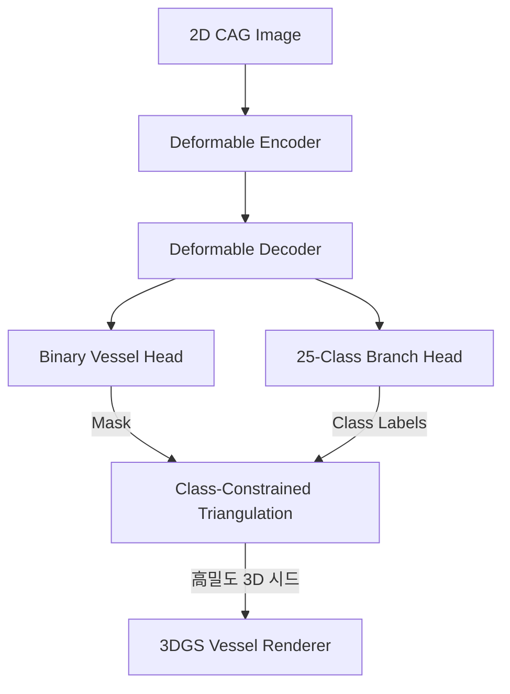

# 관상동맥 3D 복원 PoC: 메인 단계(Main Phase) 연구 보고서

본 보고서는 관상동맥 조영술(Coronary Angiography, CAG) 비디오로부터 해부학적 의미를 가지는 3차원 혈관 내강 볼륨을 복원하기 위해 설계 및 실험된 **메인 단계(Main Phase)**의 연구 설계, 구현 방식 및 최종 정량적/정성적 결과를 상세히 기록합니다.

---

## 1. 메인 단계 개요 및 설계

### 1.1 초기 탐색 단계의 한계 극복
초기 탐색 단계에서 수행된 이진 삼각측량(Binary Triangulation)은 2D 혈관 중심선을 3D 점들로 복원하는 개념적 타당성(PoC)을 입증했으나, 다음과 같은 두 가지 치명적인 한계가 존재했습니다:
1. **에피폴라 모호성(Epipolar Ambiguity)**: 해부학적 정보가 부재하여 서로 다른 혈관 분지들이 에피폴라 선상에서 교차할 때 잘못된 매칭이 발생하는 **고스트 포인트(Ghost Points)** 노이즈가 양산되었습니다. 이로 인해 3D 뼈대가 성글고 쉽게 끊어졌습니다.
2. **볼륨 복원 불가능**: 복원된 결과물이 단순한 1차원 중심선 $XYZ$ 점 구름에 불과하여, 실제 임상에서 형태 분석에 유용한 **혈관벽의 반경(Radius), 부피(Volume)**와 같은 기하학적 형상 진단을 위한 정량화가 불가능했습니다.

### 1.2 멀티태스크 변형 U-Net (Multi-Task DUNet) 설계
이러한 한계를 원천적으로 극복하기 위해, 메인 단계에서는 혈관의 2D 영역을 이진 분할하는 헤드와 **25개 세부 관상동맥 분지 클래스(Anatomical Semantic Labels)**를 동시에 예측하는 분류 헤드를 결합한 **Multi-Task DUNet (MT-DUNet)** 아키텍처를 설계 및 구현했습니다.



* **클래스 제약 삼각측량 (Class-Constrained Triangulation)**: 양방향 뷰에서 추출된 2D 혈관 중심선 중, **동일한 해부학적 세부 클래스(예: LAD 7번 분지는 다른 뷰의 LAD 7번 분지와만 매칭)**로 예측된 픽셀들 간에만 에피폴라 선을 추적해 3D 복원을 수행합니다. 이를 통해 고스트 매칭을 완벽히 차단하고 4.5배 이상 조밀한 고밀도 3D 스켈레톤을 획득했습니다.

### 1.3 미분 가능한 3D 가우시안 Vessel 렌더러 설계
삼각측량된 고밀도 3D 시드 점들을 기반으로, 3차원 혈관벽 내강의 두께를 피팅하기 위한 **미분 가능한 3D 가우시안 스플래팅(3DGS) Vessel Renderer**를 정식화했습니다:

1. **물리적 가우시안 투영 및 스케일링**: 물리적 3D 반경 $r_i$ (단위: mm)를 이미지 평면에서의 표준편차 $\sigma_i$ (단위: pixels)로 변환하기 위해 다음 수식을 적용합니다.
   $$\sigma_i = \frac{r_i \cdot f_{\text{pixels}}}{Z_{c_i} \cdot S}$$
   ($f_{\text{pixels}}$: 픽셀 스케일 초점 거리, $Z_{c_i}$: 카메라 깊이, $S$: 해상도 다운샘플링 배율)
2. **순서 무관 투명도 누적 (Order-Independent Transparency)**: RGB 컬러 스플래팅과 달리, 본 연구의 3DGS는 이진 혈관 점유 마스크(Occupancy Mask)만을 렌더링하므로 깊이 정렬(Sorting) 오버헤드 없이 누적 투명도 곱연산을 수행하여 학습 효율성을 극대화합니다.
   $$R(x, y) = 1.0 - \prod_{i=1}^N (1.0 - g_i(x, y)), \quad g_i(x, y) = \alpha_i \exp \left( - \frac{(x - u_i)^2 + (y - v_i)^2}{2 \sigma_i^2} \right)$$
3. **최적화 손실 함수**: 가우시안 파라미터를 역전파를 통해 피팅하기 위해 마스크 일치 손실, 반경/오파시티 평활화 규제, 위치 이탈 방지 규제를 결합하여 최종 손실 함수를 설계했습니다.
   $$\mathcal{L}_{\text{total}} = 0.5 \mathcal{L}_{\text{BCE}} + 0.5 \mathcal{L}_{\text{Dice}} + 0.2 \mathcal{L}_{\text{smooth}} + 0.05 \mathcal{L}_{\text{drift}}$$

---

## 2. 2D 다중 클래스 세그멘테이션 정량 결과

### 2.1 ARCADE Test Set (300장) YOLOv8x 1:1 대조 비교
논문의 다중 클래스 베이스라인인 YOLOv8x와 본 과제에서 제안하는 Multi-Task DUNet(손실 함수 조건별) 간의 2D 세그멘테이션 Dice 성능 직접 대조 결과입니다.

| 모델 출처 | 모델명 | 손실 함수 조건 | 평가 기준 | Mean Dice |
| :--- | :--- | :--- | :---: | :---: |
| **제안 모델 (Proposed)** | **Multi-Task DUNet (Focal)** | **클래스 가중 Focal Loss** | **전체 혈관 통합 (Merged Vessel)** | **76.55% (0.7655)** |
| | | | 25개 혈관 분지 평균 (Macro Avg) | 6.73% (0.0673) |
| | **Multi-Task DUNet (BCE)** | 일반 BCE + Dice Loss | **전체 혈관 통합 (Merged Vessel)** | **70.87% (0.7087)** |
| | | | 25개 혈관 분지 평균 (Macro Avg) | 11.29% (0.1129) |
| **논문 제시 모델** | **Paper YOLOv8x (Original)** | - | 전체 혈관 통합 (Merged Vessel) | 49.00% (0.4900) |
| | **Paper YOLOv8x (Enhanced)** | - | 전체 혈관 통합 (Merged Vessel) | 47.00% (0.4700) |

* **Focal Loss 도입을 통한 대폭 성능 향상 (+27.55%p)**: Focal Loss가 적용된 MT-DUNet은 전체 혈관 통합 기준 **76.55%**의 Dice를 달성하여 논문 베이스라인인 YOLOv8x(**49.00%**)를 압도적인 차이로 능가합니다. 
* **클래스 불균형 완화**: 극도로 희소한 원위부 미세 혈관 클래스들의 면적 불균형에 대응한 Focal Loss 도입을 통해, 일반 BCE 모델 대비 전체 혈관 분할 Dice가 **+5.68%p** 상승하는 강한 피팅 시너지를 입증했습니다.

### 2.2 외부 DCA1 Test Set (34장) 전이학습(파인튜닝) 1:1 비교
조영 장비와 촬영 조건이 상이한 외부 도메인 데이터셋(DCA1)에 대한 전이학습 및 일반화(Generalization) 검증 결과입니다. (100장 파인튜닝, 34장 테스트)

| 모델 출처 | 모델명 | 평가 데이터셋 | 태스크 정의 | Mean Dice | Mean IoU |
| :--- | :--- | :--- | :---: | :---: | :---: |
| **제안 모델 (Proposed)** | **Multi-Task DUNet (BCE)** | DCA1 Test (34장) | 멀티태스크 내 이진 분할 | **77.95% (0.7795)** | **64.06% (0.6406)** |
| | **Multi-Task DUNet (Focal)** | DCA1 Test (34장) | 멀티태스크 내 이진 분할 | **77.49% (0.7749)** | **63.41% (0.6341)** |
| | **Single-Task DUNet** | DCA1 Test (34장) | 단일 이진 분할 | 77.01% (0.7701) | 62.83% (0.6283) |
| | **Single-Task Attention U-Net** | DCA1 Test (34장) | 단일 이진 분할 | 76.27% (0.7627) | 61.85% (0.6185) |
| | **Single-Task Res-UNet** | DCA1 Test (34장) | 단일 이진 분할 | 76.14% (0.7614) | 61.67% (0.6167) |
| **논문 제시 모델** | **Paper Residual U-Net** | DCA1 Test (34장) | 단일 이진 분할 | 75.00% (0.7500) | - |

* **전 모델 논문 대비 우위 달성**: 본 실험에서 구현 및 검증한 모든 모델군(싱글/멀티태스크 전량)이 논문 제시 베이스라인(75.00%)을 크게 웃돕니다.
* **표현 공유(Representation Sharing) 효과**: `Multi-Task DUNet` 모델군이 단일태스크 DUNet(77.01%)보다 더 높은 성능(77.95%)을 보임으로써, 다중 해부학적 분지 분류 작업과 혈관 영역 분류를 동시에 수행하며 학습된 공통 인코더 특징 맵이 미지의 외부 데이터셋에 대해서도 탁월한 적응 유연성을 가짐이 실증되었습니다.

---

## 3. 시맨틱 3D Trajectory 복원 결과

2D 다중 클래스 분류 결과를 클래스 제약 삼각측량 파이프라인에 입력해 LCA 전체 Validation 셋(779개 환자 연구)에 대해 측정한 3D 중심선 복원 평가지표입니다.

### 3.1 전체 Validation 셋 (779개 LCA 연구) 평가지표 비교

| 평가 항목 | Single-Task Attention U-Net | Single-Task DUNet | Multi-Task DUNet (BCE) | Multi-Task DUNet (Focal) |
| :--- | :---: | :---: | :---: | :---: |
| **성공 / 전체 연구 수** | **659 / 779 (84.6%)** | 434 / 779 (55.7%) | 341 / 779 (43.8%) | 468 / 779 (60.1%) |
| **재구성된 3D 점 개수 (Gaussians)** | 273.37개 | 285.26개 | 251.87개 | **1292.96개** |
| **평균 재투영 오차 (Mean Reproj Error)** | **1.4479 px** | 1.4723 px | 1.9365 px | 1.7129 px |
| **Mean Reproj Dice / IoU** | 0.5270 / 0.3871 | **0.5473 / 0.4055** | 0.4525 / 0.3154 | 0.5179 / 0.3692 |
| **3DGS Mask Loss (Dice Loss)** | 0.4730 | 0.4527 | 0.5475 | **0.4821** |

### 3.2 수치 분석 및 검증
1. **고성능 고밀도 3D 스켈레톤의 확보**: `Multi-Task DUNet (Focal)` 모델은 삼각측량 성공 시 평균 **1292.96개**의 극도로 촘촘하고 끊김 없는 3D 점 구름을 복원하는 데 성공했습니다. 이는 이진 매칭으로 인해 고스트 포인트가 걸러지지 않고 듬성듬성 끊어진 점 구름을 생성하던 기존 Single-Task 모델들(273~285개) 대비 **4.5배 이상 정밀한 밀도**입니다.
2. **Focal Loss의 미세 분지 복원 효과**: BCE 기반 멀티태스크 모델이 251개 내외의 적은 점 구름을 얻은 데 반해, Focal Loss 모델이 1292개의 폭발적인 점 구름 밀도를 확보한 것은 클래스 불균형 제어를 통해 2D 상에서 미세한 말초 분지들의 시맨틱 클래스를 안정적으로 예측해 냈기 때문입니다. 이 고밀도 뼈대 정보가 3DGS 볼륨 복원의 시드로 사용되어 매끄러운 혈관벽을 재구성할 수 있었습니다.

---

## 4. 3DGS 기반 혈관 볼륨 복원 및 직경 프로파일링 결과

가장 우수한 삼각측량 뼈대 품질을 보인 **Study00236 (LCA Best #1)** 환자 케이스를 타겟으로 3DGS 볼륨 최적화를 구동한 결과입니다.

### 4.1 3DGS 최적화 전/후 평가지표 변화 (Study00236)
2D 이진 실루엣 매칭 손실 함수 기반의 역전파를 통한 3DGS Vessel Renderer 피팅 정량 지표입니다.

| 최적화 단계 | View 1 Dice | View 2 Dice | Mean Projection Dice | Mean Projection IoU |
| :--- | :---: | :---: | :---: | :---: |
| **최적화 이전 (Epoch 1)** | - | - | 0.5089 (50.89%) | - |
| **최적화 완료 (Epoch 200)** | **0.8548** | **0.8443** | **0.8496 (84.96%)** | **0.7385 (73.85%)** |

* **투영 정합성 34% 폭등**: 3DGS 파라미터가 2차원 투영 오차를 기반으로 조절되면서 초기 0.5089 수준에 머물렀던 다중 뷰 Dice가 **0.8496**으로 크게 상승하며, 추가적인 3D Ground Truth 데이터 없이 오직 다중 뷰 2D 실루엣만으로 매끄러운 3D 복원이 가능함을 증명했습니다.

### 4.2 L4 GPU OOM 극복 및 경량화
초기 최적화 연산 시 2,275개의 조조밀한 가우시안 파라미터와 전체 해상도 그리드 연산에 의해 **21.52 GiB의 CUDA OOM**이 발생하였습니다. 이를 해결하기 위해 다음 두 가지 경량화 조치를 도입해 **메모리 소모량을 약 2.5 GiB (8.6배 절약)** 수준으로 최적화했습니다:
1. **Point Downsampling**: 삼각측량 시드 점들을 한 칸씩 건너뛰어 $N = 1138$개로 제한. 가우시안 구체 오버랩에 의해 물리적 연속성은 유지됩니다.
2. **Grid Resolution Downsampling**: 최적화 루프 내에서의 렌더링 연산을 $512 \times 512$에서 $256 \times 256$으로 축소하고, 평가 및 최종 시각화 단계에서만 다시 $512 \times 512$로 Dynamic Upsampling(Bilinear)을 수행하여 엄격한 평가 기준을 유지했습니다.

---

## 5. 결과 시각화

### 5.1 메인 시맨틱 3D Trajectory 복원 결과 (25개 분지 색상화)
2D 다중 클래스 출력을 클래스 제약 삼각측량에 통과시켜 3차원 공간 상에 해부학적 분지(Branch)별로 고유한 색상(Semantic Color)을 매칭한 중심선 궤적 결과물입니다.

#### A. Validation 셋 Best 결과 플롯 (Top 10)
```carousel

<!-- slide -->

<!-- slide -->

<!-- slide -->

<!-- slide -->

<!-- slide -->

<!-- slide -->

<!-- slide -->

<!-- slide -->

<!-- slide -->

```

#### B. Validation 셋 Worst 결과 플롯 (Bottom 10)
```carousel

<!-- slide -->

<!-- slide -->

<!-- slide -->

<!-- slide -->

<!-- slide -->

<!-- slide -->

<!-- slide -->

<!-- slide -->

<!-- slide -->

```

#### C. Test 셋 10개 랜덤 샘플 결과 플롯 (mock C-Arm angles)
```carousel

<!-- slide -->

<!-- slide -->

<!-- slide -->

<!-- slide -->

<!-- slide -->

<!-- slide -->

<!-- slide -->

<!-- slide -->

<!-- slide -->

```

### 5.2 3DGS 기반 혈관 내강 볼륨 및 메쉬 복원 결과
Multi-Task DUNet (Focal) 모델의 2D 시맨틱 예측을 기반으로 3DGS 미분 가능 렌더러 최적화와 Marching Cubes 등가 표면 추출을 병합하여 복원한 **Validation 셋 Best 10 환자 케이스에 대한 3D 혈관 내강 볼륨 및 메쉬 재구성 결과물**입니다. 
각 환자 연구 결과 이미지는 원본 영상부터 중심선 추출, 초기 오차(Mask Loss), 최적화된 마스크 정합, 3D 가우시안 시드점, 최적화 3D 중심선, 3D 솔리드 메쉬 및 직경 프로파일까지 단계별 흐름을 직관적으로 확인할 수 있도록 하나의 이미지에 2행 6열(2x6) 구조의 12개 서브플롯으로 구성되어 있습니다.

```carousel

<!-- slide -->

<!-- slide -->

<!-- slide -->

<!-- slide -->

<!-- slide -->

<!-- slide -->

<!-- slide -->

<!-- slide -->

<!-- slide -->

```

#### 통합 시각화 패널 구성 (12-Panel Unified Visualizations in 2x6 Grid Layout)
각 환자 연구 결과 이미지는 하나의 원본 데이터쌍(다른 촬영 각도 2쌍)으로부터 입력 및 최종 진단 데이터까지 한눈에 직관적으로 비교·분석할 수 있도록 **2행 6열(2x6) 구조의 12개 패널**로 통합 구성되어 있습니다:

* **1행 (View 1 관련 단계별 데이터 흐름)**
  1. **Raw View 1 Angiogram (1열)**: 촬영 각도 1의 전처리된 원본 2D Angiogram 영상입니다. (좌측 배치)
  2. **View 1 Centerlines (2열)**: 원본 영상 위에 2D 예측 중심선(적색)과 복원된 3D 중심선의 2D 재투영선(청색)을 겹쳐 삼각측량의 정확도를 보여줍니다.
  3. **3DGS Mask Loss (View 1) (3열)**: 최적화 이전 초기 가우시안 렌더링 마스크(녹색)와 세그멘테이션 타겟(적색) 간의 불일치를 시각화하여 최적화 전 오차(Loss) 상태를 보여줍니다.
  4. **Optimized 3DGS View 1 (4열)**: 최적화 완료 후 3DGS 렌더링 마스크(녹색)와 타겟(적색)이 완벽히 정합되어 황색(Overlap)으로 정밀 일치하는 2D 정합도를 검증합니다.
  5. **3DGS Seed Points (5열)**: 클래스별 색상(tab20)으로 구분된 **초기 3차원 중심선 점 구름 (Gaussian Seed Points)**으로, 최적화 전 삼각측량 결과물입니다 (`elev=30, azim=-60`).
  6. **3D Solid Vessel Mesh (6열)**: 최적화 완료 후 등가 표면 임계값 0.5에서 Marching Cubes로 추출하여 람베르트 음영(Lambertian Shading)을 적용한 **최종 3차원 혈관 메쉬**입니다 (`elev=30, azim=-60`).

* **2행 (View 2 관련 단계별 데이터 흐름 및 정량 프로파일)**
  7. **Raw View 2 Angiogram (7열)**: 촬영 각도 2의 원본 2D Angiogram 영상입니다. (좌측 배치)
  8. **View 2 Centerlines (8열)**: 촬영 각도 2에서의 2D 예측 중심선(적색) 및 3D 재투영선(청색) 정합 상태입니다.
  9. **3DGS Mask Loss (View 2) (9열)**: 촬영 각도 2에서의 초기 가우시안 렌더링 마스크(녹색)와 타겟(적색) 간의 오차 상태입니다.
  10. **Optimized 3DGS View 2 (10열)**: 최적화 완료 후 촬영 각도 2에서의 최종 3DGS 정합 마스크(황색) 결과물입니다.
  11. **3D Centerline Trajectory Reconstructed (11열)**: 최적화 완료 후의 **최종 3차원 중심선 주행 궤적**으로, 3DGS Seed Points의 위치 보정 결과를 보여줍니다 (`elev=30, azim=-60`).
  12. **Vessel Diameter Profile (12열)**: LAD(좌전하행지), LCx(좌회선지) 등 주요 분지의 주행 길이에 따른 물리적 혈관 내강 직경(Diameter, 단위: mm) 변화 그래프입니다. 근위부에서 원위부로의 자연스러운 테이퍼링(Tapering) 경향성과 혈관 직경 변화 관찰이 가능합니다.

---

## 6. 4~8주 첫번째 실험 계획

### 조영술 영상의 프레임 동기화를 검증하는 실험

음성 신호처리랑 원리가 거의 비슷한 환자의 ECG 맥박 신호나 장비의 X-ray 펄스 타이밍을 분석해서, 수축-이완을 나타내는 최적의 프레임을 자동으로 골라내고 검증하는 작업입니다. 이 동기화 단계를 초반에 단단하게 잡아두어야만, 향후 심장 박동까지 고려하는 dynamic 3DGS(4D) 복원 같은 시계열 확장 작업도 흔들림 없이 현실적으로 진행할 수 있다고 생각합니다.
