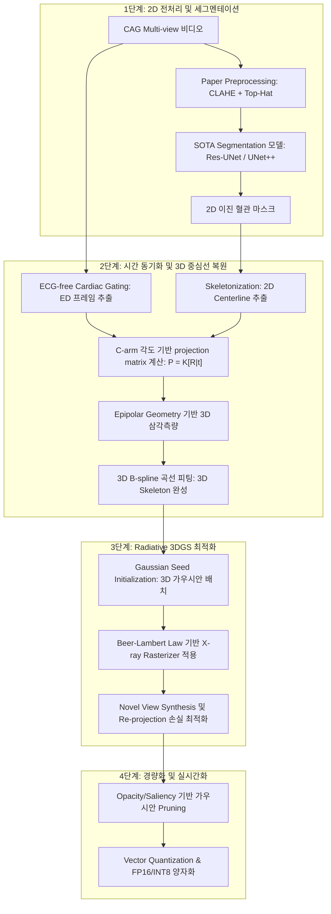

# CAG 3D Reconstruction & 3DGS PoC 구현 로드맵

본 문서는 관상동맥조영술(CAG) 영상을 기반으로 2D Vessel Segmentation에서 출발하여 최종 목표인 **3D Reconstruction 및 3D Gaussian Splatting (3DGS)**을 달성하기 위한 구체적인 아키텍처 설계와 단계별 구현 순서, 그리고 각 단계의 산출물을 정의한 누적 로드맵입니다.

---

## 1. 전체 시스템 설계 아키텍처

---

## 2. 구현 순서 및 단계별 태스크

### [Phase 1] 2D 전처리 및 세그멘테이션 고도화 (1~2주차)
*   **목표**: CAG 투영 영상에서 노이즈를 억제하고 높은 정확도로 2D 혈관 마스크를 추출합니다.
*   **태스크**:
    1.  Morphological Top-Hat 연산과 CLAHE를 활용한 조영 혈관 강도 극대화.
    2.  Edge-weighted BCE & Dice Loss를 이용한 경계선 집중 학습 루프 가동.
    3.  Res-UNet 이외에 SOTA 모델(UNet++, Attention U-Net 등)을 구현하여 비교 분석 및 성능 향상.

### [Phase 2] ECG-free Gating 및 Geometry 기반 3D 중심선 복원 (3~4주차)
*   **목표**: 심장 동적 왜곡을 최소화하고 C-arm 기하 파라미터를 이용해 3차원 혈관 중심선을 재구성합니다.
*   **태스크**:
    1.  비디오 프레임 간 L2 Norm 변화율 분석을 통해 최적의 **이완기말(End-Diastolic, ED)** 정적 프레임 자동 추출.
    2.  2D 이진 마스크를 스켈레톤화하여 1픽셀 두께의 중심선 그래프(노드, 에지) 생성.
    3.  DICOM 각도(LAO/RAO, CRA/CAU)로부터 내부 카메라 행렬 $K$ 및 회전 행렬 $R$, 변위 $t$ 계산하여 $P = K[R|t]$ 수립.
    4.  두 개 이상의 다중 뷰에서 에피폴라 선(Epipolar Line) 제약 조건을 활용해 중심선 특징점 매칭 수행.
    5.  매칭된 점들의 Triangulation 및 3D B-spline 피팅을 통한 노이즈 없는 부드러운 3D 혈관 중심선 획득.

### [Phase 3] X-ray 물리 기반 Radiative 3DGS 최적화 (5~6주차)
*   **목표**: 투과성 X-ray 물리 법칙을 반영하여 3차원 혈관 볼륨을 Gaussian Splatting으로 재구성합니다.
*   **태스크**:
    1.  물리 모델(Beer-Lambert Law)을 미분 가능한 래스터라이저(Differentiable Rasterizer)에 이식하여 투과형 누적 감쇄 렌더링 구현.
    2.  SFM 포인트 클라우드의 한계를 극복하기 위해, **Phase 2의 3D B-spline 중심선 좌표를 중심(Seed)으로 3D 가우시안들을 조밀 배치하여 초기화**.
    3.  실측 2D 영상과 렌더링 결과 간의 MSE, DSSIM, Mask Loss를 결합한 토탈 손실 함수 기반 최적화 수행.
    4.  가우시안의 형태가 바늘처럼 길어지는 현상을 막기 위한 비등방성 규제(Anisotropy Regularization) 탑재.

### [Phase 4] 실시간 추론을 위한 모델 경량화 및 평가 (7~8주차)
*   **목표**: 메모리 점유율을 낮추고 렌더링 속도를 높여 실무 적용 가능성을 검증합니다.
*   **태스크**:
    1.  가중치/불투명도 기여도가 낮은 미세 가우시안들을 자동 트리밍하는 Opacity/Saliency Pruning 적용.
    2.  자주 쓰이는 파라미터 군집을 생성하는 코드북(Codebook) 방식의 벡터 양자화(Vector Quantization) 구현.
    3.  FP32 타입의 매개변수를 FP16 및 INT8로 양자화하여 메모리 최적화.
    4.  가려진 각도 투영 영상을 생성하여 성능을 평가하는 LOOCV(Leave-One-Out Cross-Validation) 검증 수행.

---

## 3. 단계별 핵심 산출물 (Deliverables)

| 단계 | 산출 파이썬 코드 패키지 | 시각화 및 정량 검증 결과물 |
| :--- | :--- | :--- |
| **Phase 1** | • `src/model.py` (ResUNet, UNet++) • `src/preprocessing.py` • `scripts/train.py` | • 에지 가중치 맵 시각화 이미지 • Epoch별 Loss 곡선 그래프 • 10개 랜덤 검증셋 2D 추론 비교 이미지 |
| **Phase 2** | • `src/geometry.py` (Gating & P matrix) • `scripts/reconstruct_centerline.py` | • 자동 검출된 ED 프레임 인덱스 및 오차 그래프 • 3D 공간 상에 렌더링된 3D B-spline 혈관 중심선 모델 • 다중뷰 재투영 오차(Chamfer Distance) 픽셀 리포트 |
| **Phase 3** | • `src/radiative_rasterizer.py` • `scripts/train_3dgs.py` | • 3D 공간 상에 분사된 3D Gaussian Point Cloud 모델 • 렌더링된 Novel View 투영 이미지 샘플 |
| **Phase 4** | • `utils/compress_3dgs.py` • `scripts/evaluate_loocv.py` | • Pruning 전후의 Gaussian 개수 및 초당 프레임 수(FPS) 비교표 • 양자화 전후 모델 크기(MB) 비교표 • LOOCV를 통한 Novel View의 PSNR / SSIM / Dice Score 최종 테이블 |

---

## 4. 모니터링 및 업데이트 원칙

1.  **동기화**: 로컬 코드 작성과 VM 복사본 배포는 항상 병행하며 독립 실행성을 유지합니다.
2.  **형상 관리**: 구현된 SOTA 모델들은 `resunet_segmentation`, `unetplusplus_segmentation` 과 같이 아키텍처 이름을 명시한 별도의 프로젝트 폴더로 분리 관리합니다.
3.  **진척 갱신**: 각 Phase가 완료될 때마다 본 로드맵과 `task.md`를 업데이트하여 실시간 진행률을 추적합니다.
